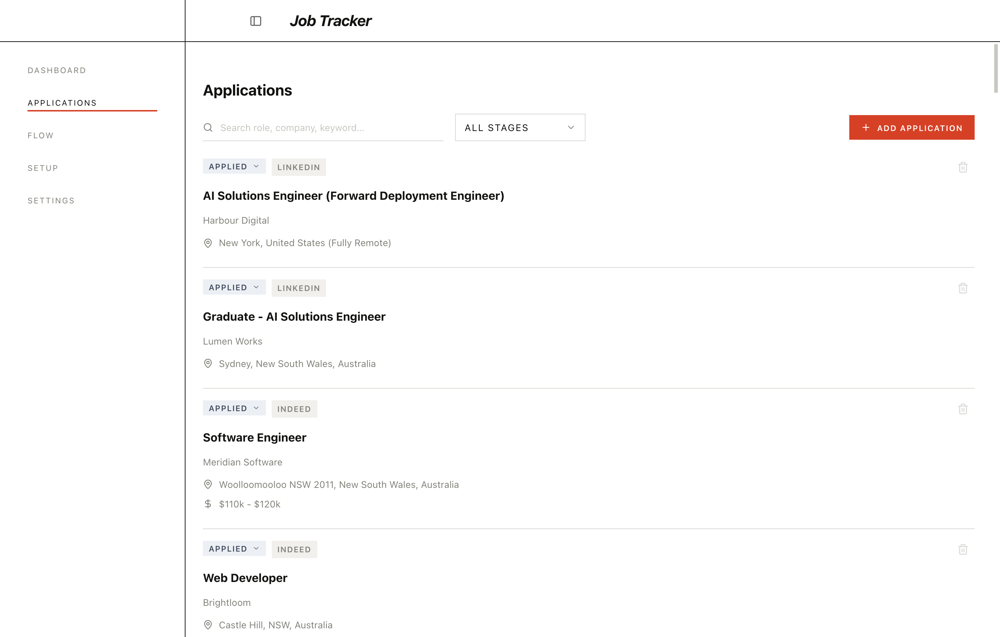
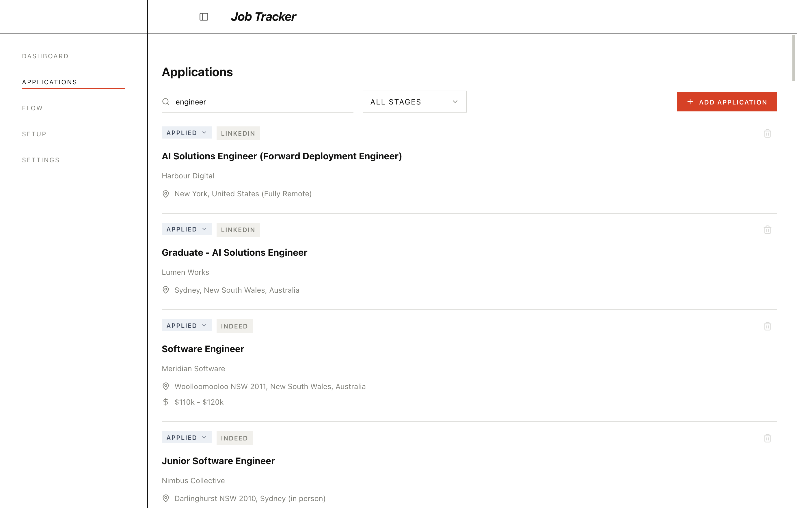
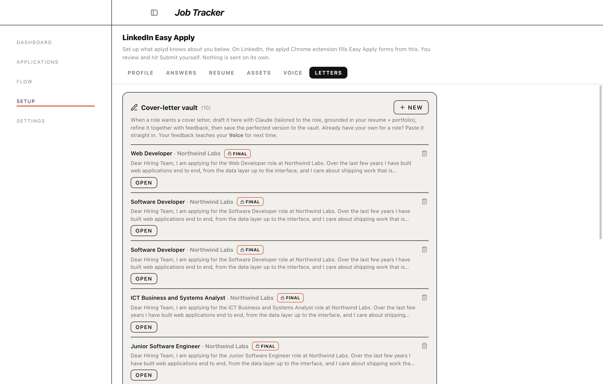
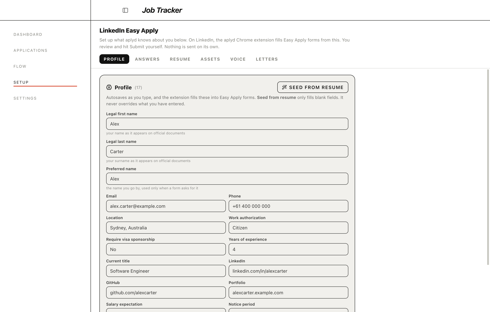

# aplyd

A desktop app I built to run my own job search. It keeps every application in one place.
It also drafts cover letters using real detail about each company, and fills in LinkedIn
Easy Apply forms from a profile I set up once.

I was applying to a lot of roles and kept losing track of where each one stood. I was also
rewriting the same cover letter over and over, and retyping the same answers into every
form. aplyd is what I made to stop doing that.

## Features

- **Tracks applications by stage.** Applied, online assessment, phone screen, interview,
  offer, and so on, with a flow you can shape per role.
- **Searches everything at once.** Type a company, a role, a location, a source, a skill,
  or any keyword, and the list narrows as you type. Words combine, so "react sydney" finds
  React roles in Sydney.
- **Writes cover letters.** Give it a role and it drafts a letter using detail about the
  company and your own background. You can refine a draft and keep older versions. Export
  any of them to PDF.
- **Fills LinkedIn Easy Apply.** Set up your profile, answers, and resumes once. A small
  Chrome extension reads that and fills Easy Apply forms in the browser. You review and
  submit each one yourself. Nothing is sent on its own.
- **Stays on your machine.** Everything is stored locally in SQLite. The only thing that
  leaves your computer is the text you ask it to draft.

## How it works

- **Free, and runs on your own Claude.** It is open source and I charge nothing for it. The
  AI features use your own Claude login, so the only thing you need is a Claude account you
  already have.
- Electron, React, and TypeScript on the front, with a local SQLite database underneath.
- Cover letters and job-listing parsing go through the Claude CLI on your own Claude login.
- A companion Chrome extension reads your saved profile and fills Easy Apply fields.
- Built and signed for macOS. A Windows build is wired up through GitHub Actions.

## Screenshots

The tracker, with search across role, company, location, and keyword:





Cover letters drafted per role and kept in one place:



The LinkedIn Easy Apply setup the Chrome extension fills from:



## Setup

aplyd is free and open source. It uses your own Claude login for the AI features (a
Claude.ai subscription or a signed-in Claude CLI both work). Your data stays on your machine.

1. **Sign in to Claude once.** Install Node and the Claude CLI, then run `claude login`.
   That is what the cover-letter and job-parsing features use. It is free and needs no API key.

2. **Build and install the app:**

   ```bash
   npm install
   npm run install-app   # builds and installs to /Applications (macOS)
   ```

   Or `npm run dev` to run it from source while developing.

3. **Add the Chrome extension** (only needed for LinkedIn Easy Apply). Open
   `chrome://extensions`, turn on Developer mode, click **Load unpacked**, and pick the
   `extension/` folder in this repo. Keep aplyd running so the extension can read your
   saved profile.

## Notes

This is the version I use day to day. It is local first: your applications, notes, and
documents stay on your computer.
